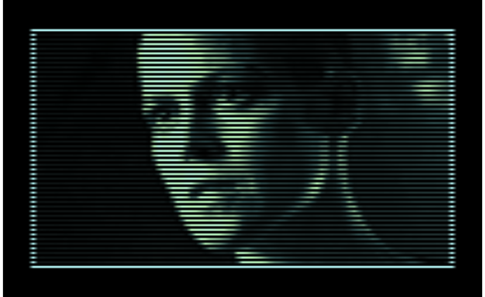
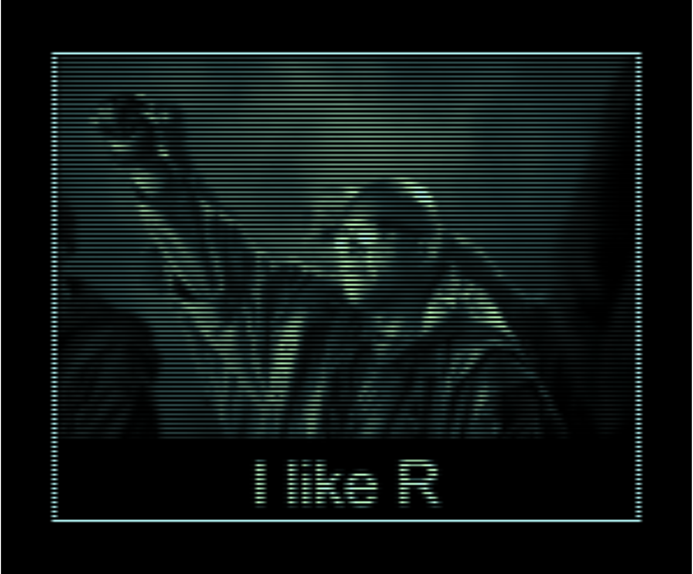
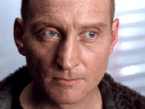
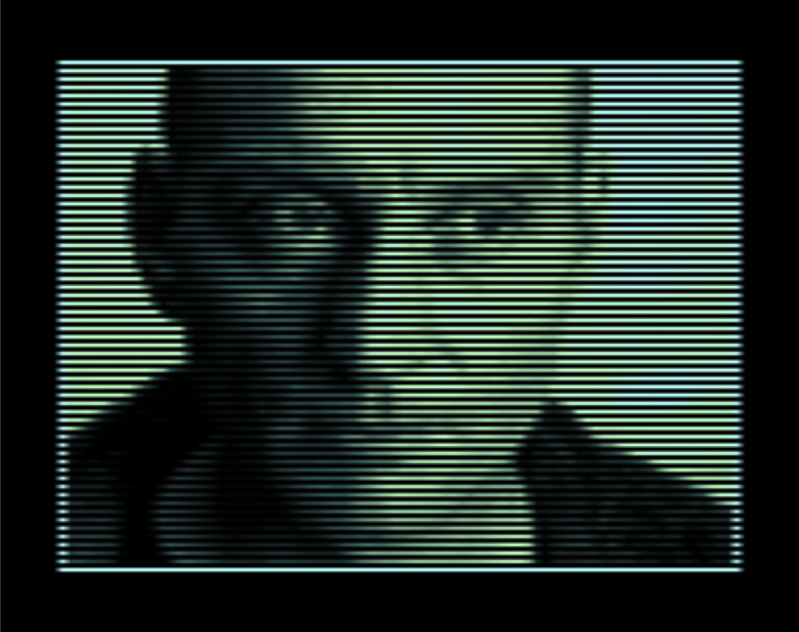
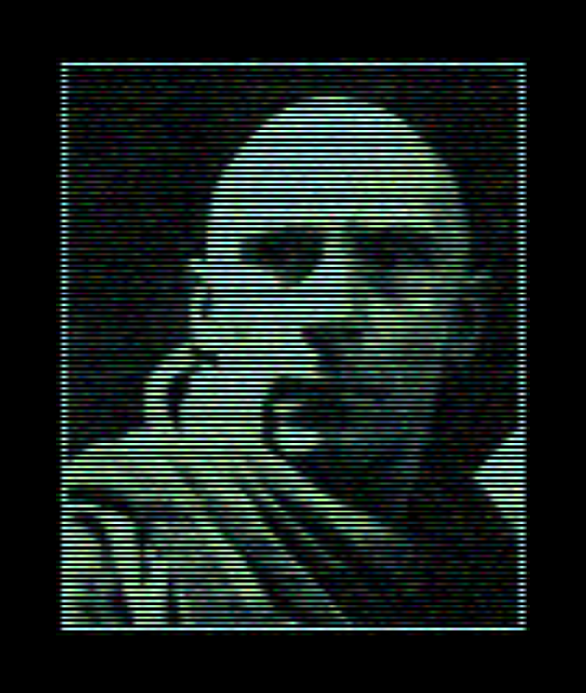

<!-- README.md is generated from README.Rmd. Please edit that file -->

# scanline 

## Intro

[](https://lifecycle.r-lib.org/articles/stages.html#experimental)

I have always loved the aesthetic feel of David Fincher’s Alien 3 film.
From the cavernous, brutal and liminal environments, to the desolate and
isolated nature of the story. In fact, I have always really loved the
aesthetic of the Alien films in general, and more recently the
incredible Alien Isolation game.

At the start of Alien 3, several ‘retro-futuristic’ scanline portrait
images are seen (shown below), and I was keen to see if I could recreate
this scanline style for any given image with R.

This project has been on the back-burner for a long time, but the rough
code I initially wrote almost a year ago has now turned into this
`{scanline}` package.

This package is super niche and is just for fun.


`{scanline}` can be installed from github

``` r
remotes::install_github('https://github.com/cj-holmes/scanline')
```

Add `{scanline}` to the search path

``` r
library(scanline)
```

Define a function for convenience in this README file that will plot the
original image and scanline image side by side

``` r
scanline_compare <- function(img, ...){
    
    i <- magick::image_read(img)
    
    patchwork::wrap_plots(
        magick::image_ggplot(i), 
        scanline(i, ...)) &
        ggplot2::theme(plot.margin = ggplot2::unit(c(1,1,1,1), "mm"))
}
```

## Example output

The default arguments try to replicate the overall feel of the original
scaline images shown above. However, many custom parameters can be
chosen to significantly change the output.

### Defaults

``` r
scanline_compare('https://www.looper.com/img/gallery/why-alien-3-almost-never-got-released/intro-1632832833.jpg')
```



``` r
scanline_compare('https://www.scified.com/articles/rumor-alien-covenants-connection-to-ellen-ripley-revealed-28.jpg')
```


``` r
scanline_compare('https://alienseries.files.wordpress.com/2012/11/alien_ripley_ref4.jpg')
```



### Non-defaults

Increase number of scanlines

``` r
scanline_compare(
    img = 'https://m.media-amazon.com/images/M/MV5BMTI4NDIyMDM2OF5BMl5BanBnXkFtZTcwMTM2NTUyMw@@._V1_.jpg', 
    every = 4)
```



Decrease number of scanlines

``` r
scanline_compare(
    img = 'https://static.wikia.nocookie.net/avp/images/0/08/Ripley_sees_Bishop%27s_blood.jpg/revision/latest/scale-to-width-down/1280?cb=20150131231549',
    every = 10)
```



Change colours

``` r
scanline_compare(
    img = 'https://static.wikia.nocookie.net/absolutehorror/images/2/28/Brett.jpg/revision/latest?cb=20120921174959',
    col_scanline = viridis::mako(10))
```


``` r
scanline_compare(
    img = 'https://bloody-disgusting.com/wp-content/uploads/2020/06/alien-1979-026-yaphet-kotto-sigourney-weaver-ian-holm-16x9-1.jpg',
    col_scanline = viridis::turbo(10))
```


